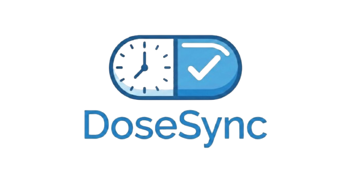

#  DoseSync

> **Gestión Inteligente de Medicamentos** > Una solución integral para la adherencia terapéutica, conectando a pacientes y profesionales de la salud en tiempo real bajo una arquitectura segura y moderna.

[](https://reactjs.org/)
[](https://firebase.google.com/)
[](https://vitejs.dev/)
[](https://www.framer.com/motion/)

**DoseSync** es una Aplicación Web diseñada para eliminar el olvido en los tratamientos médicos. A través de un ecosistema sincronizado, los pacientes reciben alertas precisas mientras los médicos supervisan el cumplimiento de forma remota y segura.

---

## 🚀 Características Principales

### 👤 Para Pacientes
- **Gestión Intuitiva:** Control total sobre recordatorios, dosis y horarios específicos.
- **Alarmas Inteligentes:** Notificaciones en tiempo real y modales interactivos para confirmación ("Tomado" u "Omitido").
- **Historial Detallado:** Registro visual con estados semánticos (Verde/Rojo) y marcas de tiempo precisas.
- **Canal Médico Directo:** Recepción de instrucciones personalizadas y ajustes de tratamiento en el inicio.
- **Acuse de Recibo:** Sistema de confirmación de lectura para mantener al médico informado con la hora exacta.

### 🩺 Para Profesionales (Médicos/Enfermeros)
- **Dashboard Centralizado:** Supervisión de múltiples pacientes vinculados mediante un código médico único.
- **Monitorización en Tiempo Real:** Visualización instantánea del cumplimiento, incluyendo dosis exactas y horarios.
- **Mensajería Encriptada:** Envío de indicaciones privadas vinculadas al UID único del paciente.
- **Trazabilidad Avanzada:** Indicadores visuales de lectura (Lucide Icons) para garantizar la recepción de instrucciones.

---

## 🛠️ Stack Tecnológico

| Capa | Tecnología |
| :--- | :--- |
| **Frontend** | React.js (v19) + Vite |
| **Backend/DB** | Firebase Realtime Database (NoSQL) |
| **Auth** | Firebase Authentication |
| **Animaciones** | Framer Motion |
| **Iconografía** | Lucide React |
| **Layout** | CSS3 (Custom Properties) - Mobile First |

🔒 **Seguridad y Privacidad**
DoseSync prioriza la integridad de los datos mediante una arquitectura de aislamiento por UID (Unique Identifier):

Acceso Restringido: Solo el médico con el código de vinculación correcto tiene visibilidad sobre el paciente.

Nodos Seguros: Las notas privadas se almacenan en rutas únicas (notasPrivadas/UID) para evitar fugas de información.

Privacidad: Historiales persistentes y protegidos para el cumplimiento normativo de salud.

---

## 📂 Estructura del Proyecto

```bash
src/
├── components/
│   ├── login.jsx              # Gestión de acceso, registro y roles
│   ├── PacienteDashboard.jsx   # Vista de usuario, alarmas y consejos dinámicos
│   ├── MedicoDashboard.jsx     # Panel de auditoría médica y mensajería
│   └── FormularioMedicamento.jsx # Gestión de tratamientos (CRUD)
├── firebase.js                # Configuración central del SDK de Firebase
├── App.jsx                    # Orquestador de rutas, lógica de alarmas y estado global
└── main.jsx                   # Punto de entrada de la aplicación

---

⚙️ **Instalación y Configuración:**

Sigue estos pasos para ejecutar el proyecto localmente:

Clonación del repositorio

git clone [https://github.com/luisjespdev/dosesync2.git](https://github.com/luisjespdev/dosesync2.git)


**Instalación de dependencias:**

npm install

Configuración de Firebase:

Actualiza las credenciales en src/firebase.js con los datos de tu proyecto:

const firebaseConfig = {
  apiKey: "TU_API_KEY",
  authDomain: "TU_DOMAIN",
  databaseURL: "TU_URL",
  projectId: "TU_PROJECT_ID",
  // ...
};

**Lanzamiento:**

npm run dev

👨‍💻 **Autor:**

Luis Espinal (LuisEspDev): Full Stack Developer

Año: 2026

<p align="center">
© 2026 DoseSync - LuisEspDev. Todos los derechos reservados.
</p>
